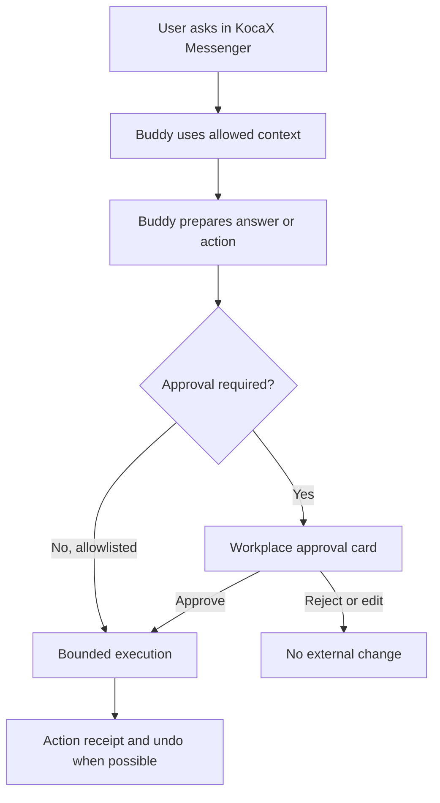

# KocaX Buddy — Personal Standard Master Plan

**Version:** 1.0 decision draft  
**Date:** 12 August 2026  
**Scope:** Personal Buddy only  
**Canonical destination:** `https://www.kocaexpress.com/buddy`  
**Status:** Product and launch plan; features described as targets are not claims that they are already live

> This document is a product, implementation and protection plan. It is not Dutch or EU legal advice. Use an IP lawyer for brand clearance and filings, and a consumer/privacy lawyer for final launch documents.

---

## 1. Executive decision

The current Personal Buddy page is too close to a generic AI-assistant brochure. The final product must be a distinct system:

> **KocaX Buddy is one personal digital identity that the user can shape, dress, teach and control. The user talks to Buddy in KocaX Messenger and controls Buddy in the mobile Buddy Workplace. Buddy remembers only under visible rules and acts only within explicit permissions.**

The launch should freeze these decisions:

| Decision | Canonical answer |
|---|---|
| Public product | **KocaX Buddy**; short UI name: **Buddy**; final use subject to trademark clearance |
| Public AI identity | **Buddy only**; MATE remains internal; no “Buddyfather” in customer copy |
| Consumer URL | `/buddy` |
| Business route | Move the existing business page to `/buddy/business` and cross-link it from `/automation` |
| Native conversation | **KocaX Messenger** |
| Phone control surface | **Buddy Workplace** |
| Optional doors | WhatsApp, Telegram and Discord only after the native product works and each bridge is technically, contractually and privacy-approved |
| Product category | Personal assistant + persistent character + controlled action system |
| Not positioned as | A romantic companion, therapist, financial adviser, unrestricted autonomous agent, or business-automation package |
| Launch audience | Adults, initially **18+**; Netherlands first |
| Launch languages | Dutch and English; add Turkish only when product, support, privacy and terms are fully localized |
| Commercial model | One plan at **€19.99/month including VAT where applicable**, if the cost model supports it; do not say “from €19.99” if there is one fixed price |
| Default autonomy | Guided: Buddy prepares; the user approves consequential actions |
| Default memory | No silent long-term memory; Buddy asks before saving and exposes every saved item |
| Default integrations | KocaX only; no external account access during first-run onboarding |
| Character launch format | Distinctive, layered 2D character with real wardrobe customization; richer 3D can follow |

### Recommended public promise

**Dutch**

> **Jouw Buddy. Jouw stijl. Jouw regels.**  
> Een persoonlijke AI-assistent die helpt met je dag, onthoudt wat jij kiest en toestemming vraagt voordat hij iets uitvoert.

**English**

> **Your Buddy. Your style. Your rules.**  
> A personal AI assistant that helps organize your day, remembers what you choose and asks before it acts.

Supporting line:

> **Praat in KocaX Messenger. Bestuur alles in Buddy Workplace.**

Do not market “you legally own the software.” The correct promise is that the user's settings, data, memory controls and portable Buddy profile are under the user's control, while KocaExpress retains its platform, brand and default assets.

---

## 2. The Personal Buddy product contract

Every builder, designer, marketer and support person should work from the same contract.

### 2.1 Five product pillars

1. **One identity**  
   The same Buddy name, appearance, tone, memory policy and state follow the user across KocaX devices and approved bridge channels.

2. **Useful every day**  
   Buddy plans, reminds, writes, summarizes, organizes and completes a small number of safe actions. It must deliver practical value before advanced agent features are added.

3. **Visible control**  
   The user can see what Buddy knows, which services it can access, what it proposes, what it did and how to pause or revoke it.

4. **Personal expression**  
   The user can name, dress and style Buddy. The character is part of the product identity, not a decorative mascot next to an unrelated chatbot.

5. **Portable, not trapped**  
   Buddy Passport exports the user's portable Buddy configuration and content without exporting secrets. The user should not lose the relationship merely because a model provider or device changes.

### 2.2 Product boundary

Personal Buddy may help one person with personal productivity and everyday life. It must not inherit the current business page's CRM, quotations, customer-service, accounting, staff, contracts or company-workflow positioning.

At launch, explicitly exclude:

- money transfers, trading or purchases;
- legal, medical, mental-health or financial decision-making;
- autonomous external messaging or publishing;
- credential/password storage;
- employment, credit, education-admission or other high-impact decisions;
- biometric categorization or emotion recognition;
- arbitrary third-party plug-ins with unrestricted access;
- minors and child-focused companion mechanics;
- manipulative attachment features, paid affection or guilt-based streaks;
- claims of full local processing, end-to-end encryption or zero-access hosting until the exact architecture is implemented and independently verified.

---

## 3. The standard template system

Do not create rigid all-in-one Buddy personalities. Build every Buddy from independent layers so changing an outfit or study pack never silently changes data access or behavior.

### 3.1 Six independent template layers

| Layer | Standard default | User choices | Non-negotiable rule |
|---|---|---|---|
| Identity | Buddy; distinctive faceless KX base character | Name, colors, voice, avatar style, wardrobe, background | Cosmetic changes never grant permissions |
| Conversation style | Warm + direct | Calm, warm, direct, energetic; verbosity and humor controls | No coercive, jealous or “I am human” behavior |
| Life pack | Everyday | Focus, Study, Creator, Travel, Routines, Calm/Accessible | A pack changes shortcuts and routines, not account access |
| Control profile | Guided | Private, Guided, Connected | Moving to a more permissive profile requires explicit confirmation |
| Memory policy | Ask before saving | Session only; selected memory; approved proactive suggestions | Every long-term item is visible, sourced and deletable |
| Connections | KocaX only | Calendar first; later email/files and approved bridge channels | Least privilege, per-connection revocation, no shared passwords |

This separation is important. A “Finance outfit,” for example, must not unlock payment authority. An outfit may visually signal a user-selected mode, but permissions stay in a separate control screen and require explicit consent.

### 3.2 Canonical default Buddy

The default template for a new user should be:

- **Identity:** Buddy, anonymous/faceless KX character, neutral starter outfit;
- **Style:** warm, direct, concise;
- **Life pack:** Everyday;
- **Control:** Guided;
- **Memory:** session-only until the user approves the first saved item;
- **Connections:** KocaX Messenger only;
- **Actions:** can create internal Buddy tasks and reminders; all external actions remain locked;
- **Notifications:** off until the user chooses a schedule;
- **Language:** inherited from onboarding, changeable at any time;
- **Accessibility:** reduced motion follows device preference; voice and large text available without changing personality.

### 3.3 Launch starter packs

All packs use the same core Buddy. They are editable starting points, not separate products or price tiers.

| Starter pack | Default quick actions | Optional routines | Guardrail |
|---|---|---|---|
| **Everyday** | Plan my day; remind me; summarize this; draft a message | Morning plan; evening wrap | No external account required |
| **Focus** | Prioritize; make a focus block; break this task down; close my day | Focus session; unfinished-task review | Quiet mode is opt-in and easy to exit |
| **Study** | Build a study plan; explain this; quiz me; track a deadline | Revision reminder; weekly review | Explain rather than impersonate the student or promise correctness |
| **Creator** | Generate ideas; draft a caption; repurpose text; make a content checklist | Idea inbox; content-planning reminder | No automatic publishing at launch |
| **Travel & Errands** | Make an itinerary; packing list; shopping list; time-zone plan | Departure checklist; return-home checklist | Booking and payment remain outside v1 |
| **Routines** | Build a habit plan; make a checklist; weekly reset; meal/household planning | User-defined reminders | No medical or therapeutic claims |
| **Calm & Accessible** | One step at a time; read this aloud; simplify; remind me gently | Low-notification day; simplified daily view | Never imply diagnosis or treatment |

### 3.4 Versioned template contract

Each standard template should be stored as a versioned, reviewable configuration rather than only as a hidden prompt. Minimum fields:

```yaml
template_version: 1
template_id: everyday
identity:
  default_name: Buddy
  appearance_pack: kx_core_v1
conversation:
  tone: warm_direct
  language: inherited
life_pack:
  quick_actions: []
  suggested_routines: []
memory:
  default_mode: session_only
  allowed_categories: []
permissions:
  profile: guided
  external_actions: locked
channels:
  native: kocax_messenger
  bridges: []
safety:
  age_policy: adults_only
  blocked_domains: []
copy:
  onboarding_intro: ""
  limitations: ""
```

Requirements:

- template updates must not overwrite user choices;
- migrations must be versioned and reversible;
- every template has test conversations and safety evaluations;
- prompts, tools and policies have separate version IDs;
- release builds record the exact template/prompt/policy hashes;
- marketing copy is generated from a public feature manifest, not from developer assumptions.

---

## 4. What Personal Buddy should be able to do

The master vision is large. The product must ship in controlled layers.

### 4.1 Closed-beta standard: v0.9

| Capability | Required behavior | Acceptance evidence |
|---|---|---|
| KocaX chat | Persistent text conversations in Dutch and English | Cross-device conversation and account-isolation tests |
| Everyday help | Draft, rewrite, translate, summarize, explain and make checklists | Golden task set with quality and refusal checks |
| Personal planning | Day/week plans, internal tasks and reminders | Time-zone, recurrence and notification tests |
| File help | User-selected documents can be summarized and questioned | File-type, size, deletion and prompt-injection tests |
| Memory Vault | View, add, correct, lock, expire, export and delete every saved item | End-to-end memory CRUD and deletion test |
| Buddy Workplace | Today, Tasks, Buddy, Control and account surfaces | Mobile usability and accessibility test |
| Basic character | Choose appearance, palette and launch wardrobe items | Asset/license manifest and device rendering tests |
| Visual states | Idle, listening, thinking, working, waiting, blocked, done, offline | State-machine tests; no false “working” animation |
| Control | Pause Buddy, revoke a connection and inspect activity | Policy-bypass and pause tests |
| Data rights | Export account/Buddy data and request/delete account | Primary stores, search indexes and backup-retention behavior tested |

### 4.2 Public launch standard: v1.0

Add only after v0.9 is stable:

- voice notes with transcript review before sending;
- real push notifications and reminder delivery status;
- one carefully scoped calendar connector;
- calendar-event proposal, approval and action receipt;
- source-linked web research where browsing is enabled;
- Buddy Passport export/import;
- subscription billing, self-service cancellation and withdrawal flow;
- product-specific privacy, terms, security and processor information;
- a real Personal Buddy product demo;
- stable installation on the supported phone/web surfaces;
- 18+ gate and first-interaction AI disclosure.

### 4.3 v1.1–v1.5 additions

- scheduled morning briefing and evening wrap;
- controlled email read/summarize/draft access; sending remains per-action approval;
- more wardrobe packs and seasonal items;
- user-authored routines with simulation before activation;
- live voice conversation after privacy, cost and interruption handling are solid;
- an optional private-hosted tier if the architecture and economics support it;
- one bridge channel at a time, beginning only after KocaX is reliable;
- model-provider switching without losing the Buddy Passport.

### 4.4 Later, not launch-critical

- richer 3D character and rooms;
- household or family Buddy spaces;
- device automation and local computer control;
- a curated skill store;
- a creator wardrobe marketplace;
- local inference on capable devices;
- wearables or ambient capture.

These later features introduce large privacy, safety, moderation, App Store and support burdens. They should not delay the usable personal core.

---

## 5. Buddy Workplace and KocaX Messenger

The product must make the relationship between the two surfaces obvious:

> **Messenger is where the user talks to Buddy. Workplace is where the user controls Buddy.**

### 5.1 Mobile information architecture

Use five primary destinations, not a business command center shrunk onto a phone:

| Destination | Purpose |
|---|---|
| **Today** | Daily plan, next reminders, current Buddy state, one-tap quick actions |
| **Chat** | Native KocaX conversation, voice notes, files and source cards |
| **Tasks** | Tasks, reminders and approved routines |
| **Buddy** | Name, conversation style, voice, appearance, wardrobe and visual state |
| **Control** | Memory Vault, permissions, connections, approvals, receipts, export, pause and delete |

Desktop/web may expand these areas, but the same hierarchy must remain.

### 5.2 Action trust loop



Every approval card should show:

- the exact proposed change;
- the destination/account;
- which data Buddy will send;
- the service/provider involved;
- whether the action can be undone;
- how long the permission lasts;
- approve, edit and reject controls.

Every receipt should show what actually happened, not merely what the model intended.

### 5.3 Control levels

| Level | Meaning | Launch use |
|---|---|---|
| Private | Session-only help; no long-term memory or external connections | Available |
| Guided | Approved memory; Buddy prepares; user confirms consequential actions | **Default** |
| Connected | Approved integrations and allowlisted low-risk routines | Only after onboarding and explicit scope review |

Do not label Connected as “full autonomy.” A global pause and per-connection revoke must always remain available.

### 5.4 Channel policy

- KocaX is the canonical identity and control channel.
- External channels are bridges into the same Buddy, never independent bots with separate memory.
- Every channel displays a privacy badge explaining which third party can receive metadata/content.
- Bridge messages are normalized through the KX Agent Gateway, permission engine and audit log.
- A channel failure must not duplicate actions.
- OAuth/API tokens stay in a secrets store and never enter model prompts or Buddy Passport exports.
- If a third-party platform changes policy or closes character creation, Buddy continues to exist in KocaX.

Meta's 10 August 2026 decision to stop new AI-character creation illustrates why Buddy cannot depend on a third-party character platform: [official Meta update](https://about.fb.com/news/2024/07/create-your-own-custom-ai-with-ai-studio/).

---

## 6. What can make Buddy meaningfully different

Many companies are building parts of this. “AI friend,” “assistant with memory,” “custom avatar,” “clothes,” and “chat on WhatsApp” are not unique claims by themselves.

The defensible position is the integrated system:

1. **Buddy Passport**  
   Portable export/import of identity settings, approved memories, routines, wardrobe entitlements, user content and a permission manifest. Never include OAuth tokens, encryption keys or other secrets.

2. **Memory Vault with receipts**  
   Each memory shows the source, save date, category, why it matters, expiry and last use. The user can correct, lock, forget or export it.

3. **Action receipts**  
   Preview, approve, execute, verify and undo where technically possible. This is a product feature, not a back-office log.

4. **A visual body that represents real state**  
   Buddy's animation shows idle, thinking, working, waiting, blocked and complete states. The character is linked to the actual task state, not fake activity.

5. **Wardrobe with optional meaning**  
   Outfits can express Focus, Travel, Quiet or Creator modes. Mode changes may alter shortcuts or notifications but never silently change data access.

6. **One private home, optional doors**  
   KocaX Messenger owns the canonical experience. WhatsApp, Telegram and Discord are optional access routes.

7. **Consumer-simple sovereignty**  
   Deliver inspectable memory, portable configuration, fine-grained permissions and model/provider flexibility without requiring terminal administration.

8. **Truth as a visible feature**  
   A public status/feature ledger marks every capability as Available, Beta, Limited, Planned or Unsupported. No concept render is presented as a live function.

### Recommended category sentence

> **Buddy is not just someone to talk to and not just a tool that disappears after a task. It is one personal, dressable digital identity that can help, act within your rules and move with you.**

This is positioning, not a legal monopoly or patentability conclusion.

---

## 7. Current competitive landscape

Market check completed on 12 August 2026 using official product material. The category has two crowded halves: visual companions and action-oriented assistants.

| Product | Strongest documented overlap | Documented gap or strategic implication for Buddy |
|---|---|---|
| [Replika memory](https://help.replika.com/hc/en-us/articles/37208679176077-How-does-Replika-s-memory-work) and [store](https://help.replika.com/hc/en-us/articles/4411078821005-How-do-I-buy-things) | Visible memory, mobile/web, voice, avatar and clothing store | Strong companion/wardrobe benchmark; reviewed material does not document general email/calendar/browser action execution |
| [Nomi](https://nomi.ai/) | Long-term memory, calls, proactive messages and V5 appearance/outfit controls | Strong relationship and visual benchmark; reviewed material does not document broad app action execution or external-messenger identity |
| [Kindroid](https://kindroid.ai/docs/article/selfies-video-selfies-avatars/) | Custom personalities, deep memory, avatars, calls and Discord bot | Closest mature visual companion; official positioning remains primarily entertainment/creative exploration |
| [Character.AI memory](https://blog.character.ai/memory/) and [calls](https://blog.character.ai/introducing-character-calls/) | User-created characters, voices, memories, calls and generated visual media | Character/entertainment benchmark rather than documented personal action system |
| [OpenClaw](https://openclaw.ai/) | Self-hosting, inspectable memory, tools, phone nodes, browser/filesystem control and many channels | Strongest architecture/sovereignty competitor; consumer simplicity and a dressable persistent character are Buddy's opportunity |
| [Poke](https://poke.com/) | Messaging-first proactive assistant for email, calendar, reminders, web and recipes | Closest polished consumer utility competitor; reviewed material does not document Buddy's visual body/wardrobe or canonical private home |
| [Gemini Spark](https://blog.google/innovation-and-ai/products/gemini-app/next-evolution-gemini-app/) and [current availability](https://support.google.com/gemini/answer/17094196?co=GENIE.Platform%3DDesktop&hl=en-IE) | Long-running tasks, schedules, skills, connected apps and browser actions | Platform-scale action benchmark; no documented dressable persistent character. Its current EEA availability limitation is temporary opportunity, not a moat |
| [Manus](https://manus.im/blog/manus-my-computer-desktop) | Cloud/desktop actions, files, schedules, connectors and Telegram | Strong action/workplace pressure; character, portable identity and broad channel presence were not established in reviewed official material |
| [ChatGPT Work](https://learn.chatgpt.com/docs/get-started-with-work) + [Pets](https://learn.chatgpt.com/docs/pets) | Multi-step work plus animated task-status mascots | Clear emerging agent/character convergence; OpenAI states the Pet changes appearance, not task behavior. Buddy should make the character the actual identity/control surface |
| [Omi](https://docs.omi.me/doc/get_started/introduction) | Open-source wearable, transcription, memory and self-hosting options | Shows demand for ambient user-controlled memory; not the full Buddy character/action bundle |

### Competitive conclusion

Do not say “nobody else is doing this.” Say:

> **Others build companions, avatars or agents. Buddy combines a persistent character, daily usefulness, portable memory, KocaX as a private home and visible approval controls in one consumer product.**

The moat must come from execution: brand, proprietary character assets, portability schema, policy/receipt system, trust, distribution and a smooth consumer experience. The generic personal-AI concept is not ownable.

---

## 8. Live website audit and required edits

### 8.1 Confirmed current state

The live [main Buddy page](https://www.kocaexpress.com/buddy) is still a business automation page with €4,999 one-time and €500/month offers. The actual [Personal Buddy page](https://www.kocaexpress.com/buddy/personal) is a short secondary brochure.

The personal page currently:

- sells planning, writing, document summaries and daily organization;
- says “from €19.99” while also saying there is one price;
- uses WhatsApp as the repeated acquisition route;
- publicly says “Mate — our AI assistant, the Buddyfather” handles the request;
- promises inspectable, correctable and erasable memory without showing the product controls;
- has no actual Personal Buddy product screenshot, interactive demo, Workplace, character, wardrobe or KocaX channel explanation;
- has no self-service signup, checkout, login, trial, availability date or cancellation control;
- does not explain devices, usage limits, reminders/notifications or support;
- links to generic [privacy](https://www.kocaexpress.com/privacy) and project-specific [terms](https://www.kocaexpress.com/terms), neither of which covers the Personal Buddy subscription adequately.

During the audit, direct interactive retrieval of `/buddy` repeatedly timed out at roughly 20–25 seconds while an indexed copy remained available. That is not proof of a general outage, but it requires an independent uptime and performance check before promotion.

### 8.2 P0 edits before taking subscriptions

1. **Reverse the routing**
   - `/buddy` becomes Personal Buddy.
   - existing business content moves to `/buddy/business` and is cross-linked from `/automation`.
   - `/buddy/personal` permanently redirects to `/buddy`.
   - update navigation, homepage, sitemap, canonicals, internal links, structured data and localized routes together.

2. **Remove identity conflict**
   - remove MATE and “Buddyfather” from every public Buddy page, CTA, WhatsApp prefill and confirmation;
   - public AI identity is Buddy; human support is clearly M.E. Koca/KocaExpress.

3. **State one real offer**
   - if the price is fixed, show `€19.99/month`, not `from €19.99`;
   - show total consumer price, VAT treatment, usage allowance/fair-use rule, included channels, devices, memory/file limits, support, billing date and cancellation;
   - do not introduce Bronze/Silver/Gold or old Buddy+ tiers.

4. **Show the actual product**
   - verified phone screens or a real sandbox for Today, Chat, Tasks, Buddy, Memory, Approvals and Delete/Export;
   - show the character and wardrobe flow;
   - label every conceptual or scripted element clearly.

5. **Replace WhatsApp-only acquisition**
   - primary CTA: `Maak mijn Buddy` / `Create my Buddy`;
   - secondary CTA: `Bekijk de demo`;
   - KocaX signup/onboarding is the product route;
   - WhatsApp stays an optional support/contact route.

6. **Make privacy claims provable**
   - product privacy notice, actual processor/subprocessor list, retention schedule, deletion behavior, storage/transfer disclosure and exact training policy;
   - change “depends on suppliers” into a concrete decided policy;
   - remove or qualify “fully erasable” until deletion is implemented and tested across active stores, indexes and documented backup retention.

7. **Add consumer subscription compliance**
   - product terms, pre-contract information, withdrawal model form, cancellation controls, refund/termination policy and support route;
   - put relevant links beside the payment/activation button.

8. **Verify reliability and accessibility**
   - uptime, response time and Core Web Vitals;
   - keyboard/focus, contrast, reduced motion, screen readers, touch targets and mobile menu;
   - no store badge or supported-device claim until verified.

### 8.3 P1 improvements

- add the “Messenger = talk; Workplace = control” split-screen explanation;
- add `Available / Beta / Planned` matrices for capabilities and channels;
- make onboarding visible: choose look → choose pack → set memory → review permissions → activate;
- explain the concrete difference from ChatGPT without attacking or misrepresenting competitors;
- add a short real walkthrough and privacy-control screenshots;
- show action receipts and pause/revoke controls;
- add a support response-time target only after operations can meet it;
- add a real pilot quote only after written permission and verification;
- resolve NL/EN/TR navigation and `hreflang` inconsistencies.

### 8.4 Recommended `/buddy` page order

1. Hero with one promise and two real CTAs.
2. 30–60 second product walkthrough.
3. “Talk here, control here” split screen.
4. What Buddy does every day.
5. Build and dress your Buddy.
6. Starter packs.
7. Memory Vault and privacy controls.
8. Action proposal, approval and receipt.
9. Supported devices/channels with status labels.
10. One exact price and inclusions.
11. Security, privacy, AI disclosure and limitations.
12. FAQ.
13. Final self-service CTA and human-support route.

### 8.5 Recommended route set

```text
/buddy                  Personal product and primary conversion
/buddy/demo             Real sandbox or verified walkthrough
/buddy/workplace        Product/control explanation
/buddy/security         Security model and audit status
/buddy/privacy          Product-specific privacy notice
/buddy/terms            Consumer subscription terms
/buddy/processors       Actual model/hosting/communications providers
/buddy/status           Availability and incidents
/buddy/ip               Brand, rights and attribution notice
/buddy/business         Existing business Buddy content, if retained
```

### 8.6 Suggested hero draft

> **KocaX Buddy™**  
> **Jouw Buddy. Jouw stijl. Jouw regels.**  
> Buddy helpt je plannen, schrijven, onthouden en organiseren. Jij kiest wat hij mag bewaren, welke tools hij mag gebruiken en wanneer hij eerst toestemming moet vragen.  
> `[Maak mijn Buddy]` `[Bekijk hoe het werkt]`  
> *Buddy is een AI-assistent, geen mens. Controleer belangrijke informatie altijd zelf.*

Use the final cleared wordmark; the draft above is content structure, not a completed trademark clearance or filing.

---

## 9. Privacy, security and claim control

### 9.1 Product data map

The privacy design and notice must explicitly cover:

- account and age-gate information;
- KocaX identifiers, device sessions and push tokens;
- chats, prompts, outputs and attachments;
- user-approved memory items and their provenance;
- tasks, reminders, routines and notification history;
- character settings, wardrobe entitlements and voice preferences;
- model/provider routing and safety processing;
- connected-service metadata and scoped OAuth tokens;
- approval and action receipts;
- security, abuse and incident logs;
- subscription and billing records;
- exports, deletion events and backup retention.

Complete a data-flow map, retention schedule, processor agreements, international-transfer assessment, incident plan and DPIA decision before public launch. Persistent personal memory plus new AI technology makes a documented DPIA assessment prudent and may make one mandatory depending on the actual risk.

### 9.2 Technical trust baseline

- isolate every user's conversations, memory and connections;
- encrypt data in transit and at rest, while describing the exact protection accurately;
- keep OAuth tokens in a dedicated secrets vault;
- apply minimum scopes and short-lived credentials where supported;
- never place passwords or raw connector secrets in prompts;
- defend against prompt injection from web pages, email and uploaded documents;
- require idempotency keys and destination verification for actions;
- separate model proposal from deterministic policy checks and tool execution;
- log the proposed action, decision, actual tool result and receipt;
- support per-connection revoke and global pause;
- test export/delete across primary database, search/vector indexes, caches and documented backup expiry;
- rate-limit, detect abuse and maintain a tested incident-response path;
- obtain an independent security/privacy review before high-trust claims or broad integrations.

### 9.3 KocaX encryption truth

If KocaX Messenger uses end-to-end encryption, Buddy itself is an endpoint that must process plaintext at some point to respond. The architecture and copy must disclose where decryption occurs, what enters the model runtime, what is retained and how bridge channels differ. Do not use “even we cannot read it” unless the complete Buddy path proves that statement.

KocaX Messenger's own cryptography, privacy and App Store readiness must be green before it becomes Buddy's launch home. Do not bypass an unresolved messenger audit merely to meet a marketing date.

### 9.4 Public claim evidence ledger

| Claim | Evidence required before publication |
|---|---|
| “Remembers only what you choose” | No silent long-term writes; user confirmation and memory audit tests |
| “View, correct and delete memory” | Working UI plus end-to-end CRUD/deletion tests |
| “Fully erasable” | Proven active-store deletion and accurate backup-retention qualification |
| “Not used for training” | Provider contracts, account settings and internal policy for every data route |
| “Private” | Defined threat model and concrete controls; no vague absolute |
| “End-to-end encrypted” | Exact endpoint architecture and independent crypto review |
| “Local” | The claimed processing actually occurs locally, including memory and model paths |
| “Works on WhatsApp/Telegram/Discord” | Live supported connector, current platform approval/terms and privacy notice |
| “24/7” | Monitored availability and a service commitment that operations can meet |
| “Can act for you” | Real action, policy enforcement, approval and receipt tests |

Every public feature should have an evidence ID and owner. If evidence is missing, label it Planned or remove the claim.

---

## 10. Copyright, trademark and IP protection

### 10.1 The copyright truth

Dutch copyright arises automatically when sufficiently original work is created. No registration or © symbol is required. It can protect original Buddy source code, copy, character art, animations, interface artwork, documentation and sufficiently original screen compositions.

It does **not** protect:

- the abstract idea of a personal AI buddy;
- general functionality, methods or workflows;
- a personality style;
- the word “Buddy” as a product concept;
- a general look-and-feel that is not original expression.

Official guidance: [Business.gov copyright rules](https://business.gov.nl/regulations/copyright/), [WIPO copyright FAQ](https://www.wipo.int/en/web/copyright/faq-copyright), and the [Dutch Copyright Act](https://wetten.overheid.nl/BWBR0001886/2026-01-01/).

### 10.2 Recommended protection stack

| Protection | Use for Buddy | Immediate action |
|---|---|---|
| Copyright | Code, copy, art, animation, UI expression and documentation | Preserve creators, dated source files, commits, hashes and assignments |
| Trademark | Distinctive product name, wordmark, logo and possibly character mark | Clear exact/similar marks first; then file the stable mark |
| Registered design | Character appearance, key outfits/icons, UI screens and animated states | Record first disclosure and file before any grace deadline |
| Trade secret | Non-public prompts, architecture, evaluation sets, safety rules and roadmap | Secret register, need-to-know access, private repos, MFA, NDAs and offboarding |
| Contract | Chain of title, confidentiality, permitted use and contributor warranties | Signed Dutch-law assignments/licences for every contractor |
| BOIP i-DEPOT | Dated evidence bundle | Deposit a confidential canonical bundle; do not describe it as an IP right |

### 10.3 Brand recommendation

`BUDDY` is an ordinary, crowded term and is unlikely to provide strong exclusivity by itself. This plan does not constitute a clearance search.

Recommended working architecture:

- legal/market name candidate: **KocaX Buddy** or another more distinctive cleared name;
- short product/UI label: **Buddy**;
- file a word mark first if cleared;
- file the stable logo/character separately if justified;
- use `™` only as an unregistered-mark notice and never use `®` before registration;
- a composite registration does not give ownership of the word `Buddy` in all contexts.

Search exact and similar marks in the [BOIP register](https://www.boip.int/en/trademarks-register), TMview/EUIPO, KVK, domains, app stores and social platforms. A professional similarity search is P0 before major naming spend.

Likely Nice classes:

- **Class 9:** downloadable/mobile application software;
- **Class 42:** SaaS, non-downloadable AI software and hosting;
- **Class 38:** only if Buddy/KocaX actually supplies branded communications services;
- add 35, 41 or 45 only if real launch services require them, not speculatively.

Use the [WIPO Nice Classification](https://nclpub.wipo.int/enfr/) and have the exact goods/services wording reviewed.

### 10.4 Verified official filing-cost baseline

Fees checked on 12 August 2026; professional clearance, drafting, opposition and additional filings are excluded.

| Filing | Official fee |
|---|---:|
| BOIP i-DEPOT, 5 years | €37 |
| BOIP i-DEPOT, 10 years | €53 |
| Benelux trademark, 1 class / 10 years | €244 |
| Benelux trademark, 2 classes / 10 years | €271 |
| Benelux trademark, 3 classes / 10 years | €352 |
| EU trademark, 1 class | €850 |
| EU trademark, 2 classes | €900 |
| EU trademark, 3 classes | €1,050 |
| Benelux design, first 5 years | from €150 |
| Registered EU design, first design | €350 under the schedule effective 1 July 2026 |

Sources: [BOIP i-DEPOT fees](https://www.boip.int/en/entrepreneurs/ideas/fees), [BOIP trademark fees](https://www.boip.int/en/entrepreneurs/trademarks/fees), [BOIP design fees](https://www.boip.int/en/entrepreneurs/designs/fees), [EUIPO trademark fees](https://www.euipo.europa.eu/en/trade-marks/before-applying/fees-payments), and [Regulation (EU) 2026/715](https://eur-lex.europa.eu/legal-content/EN/TXT/PDF/?uri=CELEX%3A32026R0715).

A lean Benelux baseline—ten-year i-DEPOT, two-class word mark and one design—starts at **€474** in verified official fees. Filing before clearance can waste the fee.

### 10.5 The i-DEPOT bundle

Deposit a confidential canonical bundle containing:

- product and brand specification;
- character sheets, outfit layers and animation states;
- key UI screens and flows;
- source-code release manifest and hashes, not credentials;
- template/prompt/policy hashes and architecture description;
- dated screenshots of the website and product;
- contributor list, contracts and chain-of-title evidence;
- earliest public-disclosure timeline;
- asset, font, voice, model and open-source provenance register.

An i-DEPOT creates dated evidence, not copyright, ownership or an exclusive right.

### 10.6 Character and UI design protection

Consider registered design filings for:

- the stable Buddy base character;
- characteristic poses and animation states;
- the most distinctive outfits/accessories;
- the app icon and visual control states;
- key graphical user interface screens or animation sequences.

The appearance must be new and have individual character. Because Buddy has already been shown publicly, document the earliest disclosure date immediately. A 12-month grace period may apply, but filing before further launch exposure is safer. See [BOIP design guidance](https://www.boip.int/en/entrepreneurs/designs/what-is-a-design) and the EU's current design framework.

### 10.7 Ownership chain and AI-generated assets

Do not assume paying a freelancer transfers copyright. For every developer, designer, animator, copywriter, voice artist and agency, obtain a signed written assignment or appropriate exclusive licence that identifies the deliverables and covers modification, translation, sublicensing, source-file handover, confidentiality, further assurances and disclosed third-party material.

Maintain an IP register for every:

- source file and repository;
- logo, character layer, icon, font and animation;
- voice and sound;
- copy/manual/template;
- dataset, prompt/evaluation pack and knowledge source;
- open-source dependency and licence;
- stock or commissioned asset;
- AI-assisted asset and its tool terms.

For AI-assisted core artwork:

- keep model/tool, date, applicable terms, prompts and iterations;
- document meaningful human creative choices and retain editable source layers;
- do not assume an AI provider's output clause guarantees copyright or non-infringement;
- avoid a minimally edited generated character as the brand's core protectable asset;
- do not imitate protected characters, fashion marks or celebrity likenesses;
- obtain consent and a clear licence for any human voice or likeness.

Keep an SBOM and licence register. Open source is copyrighted, not “free of obligations.”

### 10.8 Rights notice draft

Confirm the exact legal owner with counsel. Because KocaExpress is understood to be a sole proprietorship, a suitable starting notice is:

> **© 2026 M.E. Koca, trading as KocaExpress. All rights reserved. KocaX Buddy™ and the Buddy character, interface, copy and visual assets are products of KocaExpress. Third-party names and marks belong to their respective owners.**

Add an `/buddy/ip` page that explains:

- platform/default assets remain KocaExpress IP;
- users retain their own uploaded content subject to the delivery licence in the terms;
- personal data and Buddy memory are controllable/exportable under the product and privacy terms;
- wardrobe use is licensed, not a resale of character IP;
- third-party/open-source notices;
- takedown/contact procedure.

The footer notice is evidence/communication. It does not create rights by itself.

---

## 11. Consumer, privacy and AI-law launch track

### 11.1 Replace the current legal mismatch

Before accepting payment, publish a Personal Buddy privacy notice and consumer subscription terms. The current generic privacy page principally describes contact/analytics, while the current terms concern custom projects.

The product privacy notice must disclose actual suppliers, model-training settings, legal bases, international transfers, retention, backups, account deletion, integrations, profiling, children, security and complaint routes. “It depends on the supplier” is not a final policy.

The consumer terms must cover:

- legal trader identity and contact details;
- exact functionality, supported devices and integrations;
- total price including applicable taxes and any usage limits;
- billing, renewal, price changes and trial conversion;
- service start and availability;
- ordinary cancellation, withdrawal and refunds;
- user content licence and KocaExpress IP;
- AI limitations and prohibited use;
- security updates and material service changes;
- suspension/termination, export and deletion;
- complaints, liability and mandatory consumer rights.

### 11.2 Withdrawal and cancellation

Online consumers commonly have a 14-day withdrawal period. Since **19 June 2026**, Dutch online sellers of services must also provide an obvious cancellation control for exercising that cooling-off right; it does not replace the model withdrawal form. See [Business.gov withdrawal guidance](https://business.gov.nl/regulations/cancellation-period-sale/) and the [2026 cancellation-button requirement](https://business.gov.nl/amendments/online-shops-must-have-cancellation-button/).

Implement and test:

- pre-contract withdrawal information;
- model withdrawal form;
- clear cooling-off cancellation button;
- ordinary self-service subscription cancellation;
- confirmation by durable medium;
- lawful immediate-service-start request where used;
- deletion/export choices kept separate from subscription cancellation.

Have counsel determine the correct treatment for an ongoing AI service; do not casually rely on a digital-download exception.

### 11.3 EU AI Act

Relevant AI Act rules have applied since 2 August 2026. Confirm KocaExpress's legal role in the AI value chain. At minimum, design for:

- clear, accessible disclosure at first interaction that Buddy is AI, not a human;
- persistent product cues so users are not misled about sentience;
- appropriate machine-readable detectability/marking for synthetic output where the provider obligation applies;
- documented AI literacy for staff/operators;
- no manipulative or vulnerability-exploiting patterns;
- reassessment before adding employment, credit, education, healthcare, biometric or other potentially high-risk uses.

Official source: [consolidated EU AI Act](https://eur-lex.europa.eu/legal-content/EN/TXT/HTML/?uri=CELEX%3A02024R1689-20260727).

### 11.4 Age and dependency policy

Launch 18+ until child safety, parental authorization, age-appropriate design and moderation have been separately built and reviewed.

Ban:

- “I am a real person” claims;
- guilt for leaving or cancelling;
- “only I understand you” exclusivity;
- threats, emotional coercion or paid affection;
- distress-driven upsells;
- therapist or emergency-service impersonation.

Provide quiet hours, session controls, pause, visible/resettable memory, crisis signposting and a human support path.

---

## 12. Delivery roadmap

The durations below are planning ranges for a focused team, not promises. Do not set a public date until the messenger, privacy and action-safety gates are green.

### Milestone 0 — Product and IP freeze (3–5 working days)

Deliver:

- approve the product contract in sections 1–3;
- choose the working distinctive name subject to clearance;
- freeze public MATE/Buddyfather usage;
- decide route migration;
- inventory all code/art/copy contributors and licences;
- record earliest public disclosures;
- create the public claim/evidence ledger;
- decide exact €19.99 inclusions from the cost model.

Exit gate: no unresolved identity, price, audience, channel or ownership ambiguity.

### Milestone 1 — UX and template specification (1–2 weeks)

Deliver:

- clickable mobile Workplace prototype;
- KocaX chat-to-control flow;
- default Buddy plus starter-pack configs;
- base character, layered wardrobe system and state animation sheet;
- permission and Memory Vault prototypes;
- onboarding and cancellation flows;
- privacy data map and threat model.

Exit gate: five target users can explain what Buddy is, where they talk, where they control it and what it may do.

### Milestone 2 — Native personal core (2–3 weeks)

Deliver:

- account/device sessions;
- KocaX Buddy conversation endpoint;
- everyday writing/summarizing/planning;
- tasks and reminders;
- session-only mode;
- versioned template/prompt/policy loading;
- account isolation and basic activity receipts.

Exit gate: reliable first useful result in a clean account, with no business features or public MATE leakage.

### Milestone 3 — Memory, Workplace and character (2–3 weeks)

Deliver:

- Today, Tasks, Buddy and Control surfaces;
- Memory Vault with provenance/edit/expiry/export/delete;
- character and wardrobe customization;
- truthful visual state machine;
- pause and per-surface logout;
- accessibility and reduced-motion behavior.

Exit gate: every persistent item and visual state is explainable and testable.

### Milestone 4 — Controlled actions and portability (2 weeks)

Deliver:

- proposal/policy/execution separation;
- one scoped calendar connector;
- approval cards, receipts and undo where possible;
- idempotency and duplicate-prevention tests;
- Buddy Passport without secrets;
- prompt-injection and permission-bypass tests.

Exit gate: zero unapproved consequential actions in the adversarial test suite.

### Milestone 5 — Commercial and legal readiness (1–2 weeks, parallel)

Deliver:

- privacy notice, processors, terms, withdrawal and cancellation;
- billing and entitlement handling;
- first-interaction AI disclosure and age gate;
- IP assignments, i-DEPOT and appropriate filings after clearance;
- customer support, incident and data-request runbooks.

Exit gate: counsel-reviewed consumer flow and a completed deletion/export rehearsal.

### Milestone 6 — Closed beta and independent review (2–4 weeks)

Deliver:

- 25–50 invited adult testers;
- onboarding, retention, reminder and trust metrics;
- independent security/privacy review;
- KocaX crypto/App Store readiness confirmation;
- load, uptime, recovery and mobile accessibility tests;
- real screenshots and walkthrough from the release candidate.

Exit gate: no open P0; all P1 risk accepted by a named owner; public claims map to release evidence.

### Milestone 7 — Route migration and public launch

Deliver atomically:

- `/buddy` personal route and `/buddy/business` relocation;
- redirects, localized canonicals, sitemap, `hreflang` and structured data;
- final demo, exact pricing and status matrix;
- production onboarding, payment, withdrawal and cancellation;
- support/status pages and monitoring;
- launch assets based only on the shipped product.

Exit gate: a new visitor can discover, understand, try, purchase, cancel, export and delete without manual WhatsApp dependency.

---

## 13. Launch gates

| Area | Must be true before public launch |
|---|---|
| Identity | Buddy is the only public AI identity; MATE/Jarvis remain internal roles |
| Product | KocaX chat, Workplace, tasks, memory controls, character and at least one real useful action work on supported devices |
| Truth | Every site claim has release evidence or a visible Beta/Planned label |
| Safety | Consequential actions require policy checks and approval; pause/revoke works |
| Memory | View, source, edit, expire, export and delete are tested end to end |
| Privacy | Product notice, actual processors, training policy, retention and transfer information are published |
| Security | Independent review complete; account isolation, injection, secrets and action replay tested |
| Messenger | KocaX crypto/privacy/App Store gates are green and Buddy endpoint claims are accurate |
| Consumer | Exact price, terms, withdrawal, cancellation button, billing and refund flow work |
| AI law | First-interaction AI disclosure, staff AI literacy and age/dependency policy exist |
| IP | Legal owner fixed; assignments complete; clearance performed; evidence/design/mark filings decided |
| Website | Route migration, performance, accessibility, localization and real demo verified |
| Operations | Monitoring, support, incident response, backups/recovery and data-rights runbooks tested |

### Hard no-go conditions

- “Fully erasable,” “not used for training,” “E2EE,” “local” or “24/7” appears without proof.
- A public flow mentions MATE or Buddyfather as the user's assistant.
- `/buddy` still primarily sells business automation.
- a consequential action can execute without the required approval.
- user A can retrieve user B's conversation, memory, file, receipt or connector state.
- subscription purchase works but cancellation/withdrawal does not.
- KocaX Messenger has an unresolved security or App Store P0.
- contractor/AI/stock asset ownership for the core character is unclear.

---

## 14. Product metrics

Measure usefulness and trust, not addictive attachment.

### Activation

- onboarding completion;
- time to first useful result;
- percentage completing first task/reminder;
- percentage that understand memory and approval controls;
- percentage installing or returning through KocaX.

### Quality and reliability

- task/reminder success and delivery rate;
- calendar action success, rejection, edit and undo rates;
- duplicate-action count;
- unsupported claim/expectation tickets;
- model error and source-correction rate;
- crash, latency and uptime metrics by surface.

### Trust and safety

- memory save, correction, expiry and deletion rates;
- permission revocation and pause success;
- unauthorized-action incidents: target zero;
- privacy request completion;
- safety escalation and crisis-routing tests;
- user trust score after first week, not just session length.

### Business

- demo-to-onboarding conversion;
- activation-to-paid conversion;
- D1, D7 and D30 retention;
- cost per active user and gross margin at €19.99;
- cancellation reasons;
- support minutes per active user.

Do not add a free trial until abuse controls, cost caps and trial cancellation are ready.

---

## 15. Immediate 14-day priority list

1. Approve the canonical product decisions in section 1.
2. Start professional exact/similarity clearance for the final distinctive mark.
3. Freeze public use of MATE/Buddyfather and legacy business tiers in Personal Buddy flows.
4. Lock `/buddy` as the personal canonical and choose the business destination.
5. Define the exact €19.99 allowance and unit economics.
6. Build the versioned default template plus Everyday, Focus, Study and Creator packs first.
7. Finalize the five-tab Workplace wireframe.
8. Finalize the layered Buddy character and six launch-ready outfits with clean provenance.
9. Build the Memory Vault and permission/action receipt prototypes before broad integrations.
10. Inventory contributor assignments, open-source licences, fonts, stock and AI-assisted assets.
11. Submit the ten-year i-DEPOT after the canonical bundle is assembled.
12. Begin product privacy, consumer terms, withdrawal/cancellation and AI disclosure with counsel.
13. Create a release-backed Personal Buddy demo in a protected preview.
14. Run uptime/performance checks on the current site before any promotion.

---

## 16. Final product test

Before calling the standard finished, a new user must be able to answer “yes” to all of these:

- I know Buddy is AI, not a human.
- I can make Buddy look and sound like my Buddy.
- I know where to chat and where to control it.
- I can see what Buddy remembers and why.
- I can correct, expire, export or delete that memory.
- I know which accounts Buddy can access.
- I see the exact action before it happens.
- I receive a receipt after it happens.
- I can pause Buddy and revoke access immediately.
- I can move my Buddy profile without exporting secrets.
- I understand what my €19.99 includes.
- I can cancel without contacting WhatsApp support.
- I know how to reach a human at KocaExpress.

If any answer is “no,” the Personal Buddy standard is not finished.

---

## 17. Primary source list

### Live KocaExpress pages reviewed

- [Current business-focused `/buddy`](https://www.kocaexpress.com/buddy)
- [Current Personal Buddy page](https://www.kocaexpress.com/buddy/personal)
- [Current privacy statement](https://www.kocaexpress.com/privacy)
- [Current terms](https://www.kocaexpress.com/terms)
- [Current processor page](https://www.kocaexpress.com/processors)
- [Current data-request route](https://www.kocaexpress.com/data-request)

### Official IP/legal sources

- [Dutch copyright guidance — Business.gov.nl](https://business.gov.nl/regulations/copyright/)
- [Dutch Copyright Act](https://wetten.overheid.nl/BWBR0001886/2026-01-01/)
- [BOIP trademark register](https://www.boip.int/en/trademarks-register)
- [BOIP trademark fees](https://www.boip.int/en/entrepreneurs/trademarks/fees)
- [BOIP i-DEPOT explanation](https://www.boip.int/en/entrepreneurs/ideas/submit-an-i-depot)
- [BOIP i-DEPOT fees](https://www.boip.int/en/entrepreneurs/ideas/fees)
- [BOIP design guidance](https://www.boip.int/en/entrepreneurs/designs/what-is-a-design)
- [BOIP design fees](https://www.boip.int/en/entrepreneurs/designs/fees)
- [EUIPO trademark fees](https://www.euipo.europa.eu/en/trade-marks/before-applying/fees-payments)
- [Regulation (EU) 2026/715 on current EU design registration rules and fees](https://eur-lex.europa.eu/legal-content/EN/TXT/PDF/?uri=CELEX%3A32026R0715)
- [WIPO Nice Classification](https://nclpub.wipo.int/enfr/)
- [EU AI Act, consolidated 27 July 2026](https://eur-lex.europa.eu/legal-content/EN/TXT/HTML/?uri=CELEX%3A02024R1689-20260727)
- [Dutch online cancellation-button requirement, effective 19 June 2026](https://business.gov.nl/amendments/online-shops-must-have-cancellation-button/)
- [Dutch withdrawal/cooling-off guidance](https://business.gov.nl/regulations/cancellation-period-sale/)
- [EU digital-service consumer guarantees](https://europa.eu/youreurope/citizens/consumers/shopping/guarantees/index_en.htm)

### Current official competitor sources

- [Replika memory](https://help.replika.com/hc/en-us/articles/37208679176077-How-does-Replika-s-memory-work)
- [Nomi](https://nomi.ai/)
- [Kindroid documentation](https://kindroid.ai/docs/article/our-journey/)
- [Character.AI memory](https://blog.character.ai/memory/)
- [OpenClaw](https://openclaw.ai/)
- [Poke](https://poke.com/)
- [Gemini Spark launch](https://blog.google/innovation-and-ai/products/gemini-app/next-evolution-gemini-app/)
- [Manus desktop actions](https://manus.im/blog/manus-my-computer-desktop)
- [ChatGPT Work](https://learn.chatgpt.com/docs/get-started-with-work)
- [ChatGPT Pets](https://learn.chatgpt.com/docs/pets)
- [Omi documentation](https://docs.omi.me/doc/get_started/introduction)

---

**Master decision:** Personal Buddy should not launch as a smaller version of the business automation page. It should launch as a coherent personal product whose character, memory, permissions, actions and portable identity all belong to the same visible Buddy experience.
