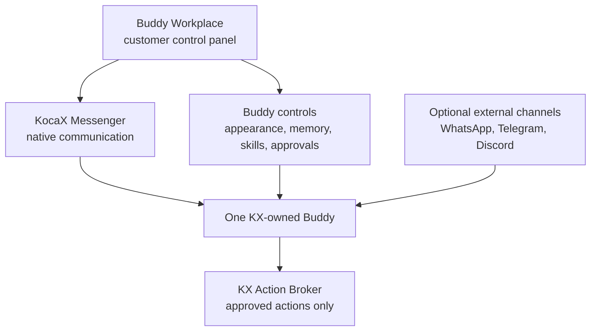
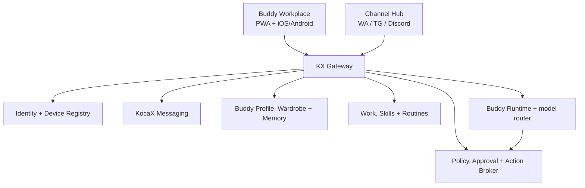

# KX Buddy Workplace + KocaX Messenger — Product Master Plan

**Version:** 2.0

**Date:** 12 August 2026

**Status:** Product and build contract

**Supersedes as product master:** `KX-SOVEREIGN-AGENT-PLATFORM-MASTER-PLAN-2026-08-12.md`

**Relationship to the earlier plan:** The sovereign KX Agent Platform remains the technical foundation. This document corrects the end goal and places that infrastructure underneath the customer product.

## 1. The decision in one sentence

> Every customer receives one personal, customizable **Buddy** inside **KocaX Messenger**; the app on the customer’s phone is the **Buddy Workplace** where they communicate with Buddy, dress and personalize him, manage his memory and skills, connect other channels, approve actions, and remain in control.

KocaX Messenger is Buddy’s native home and original communication channel. WhatsApp, Telegram, Discord, and future services are optional doors into the same KX-owned Buddy. They never become Buddy’s identity, memory, workplace, or authority.

## 2. What the product is—and is not

### The product

Buddy is both:

1. A recognizable digital companion who lives on the user’s phone, tablet, and computer.
2. A practical personal assistant for chat, planning, reminders, documents, routines, and approved actions.

The emotional connection comes from appearance, voice, continuity, and useful behavior. Trust comes from visible memory, clear permissions, exact approvals, and the ability to disconnect, export, correct, or delete everything.

### It is not

- A Telegram bot with a new logo.
- A generic chat box hidden behind an avatar.
- A copy of MATE for customers.
- A character that pretends to be human or conscious.
- A system that reads every external conversation.
- A replacement for medical, legal, financial, or crisis professionals.
- An autonomous account allowed to send, buy, publish, delete, or change important things without permission.

## 3. Product and identity language

| Name | Meaning | Customer-facing? |
| --- | --- | --- |
| **KX Buddy** | Product family and protected character | Yes |
| **Buddy** | The customer’s personal AI companion | Yes |
| **Buddy Workplace** | The control panel on phone, tablet, and desktop | Yes |
| **KocaX Messenger** | Buddy’s native communication channel and human messenger | Yes |
| **Buddy+ Business** | Business automation/workplace product | Yes, as a product name |
| **MATE** | KX’s private internal coordinator | Never |
| **Jarvis** | KX’s private internal administration layer | Never |

“Your personal mate” may be used as ordinary marketing language, but **MATE** remains a reserved internal KX system name. Customers receive Buddy. A customer may give their Buddy a private nickname, but the product identity and verified system label remain Buddy.

Public interfaces must never show `MATE`, `Mate`, `Buddyfather`, model-provider names, internal agent IDs, or backend service names.

## 4. The product hierarchy



The hierarchy is deliberate:

1. **Buddy Workplace** owns the complete experience.
2. **KocaX Messenger** is the full-trust, native conversation surface.
3. **External channels** are reduced-capability communication adapters.
4. **KX Control Plane** owns identity, memory, policy, routing, and receipts.
5. **AI providers and social platforms** are replaceable services.

## 5. The Buddy Workplace on the phone

The mobile app is not merely a Messenger inbox. It is the personal workplace and control panel for Buddy.

### Recommended five-tab structure

| Tab | Primary purpose |
| --- | --- |
| **Today** | Buddy status, schedule, reminders, open tasks, useful suggestions, connection health |
| **Chat** | KocaX Messenger contacts plus a permanently pinned Buddy conversation |
| **Work** | Tasks, notes, documents, lists, calendar, routines, and skills |
| **Buddy** | Live character, wardrobe, saved outfits, voice, private nickname, tone, and behavior |
| **Control** | Memory, permissions, connections, devices, approvals, activity, export, and deletion |

### Today

The first screen should answer three questions immediately:

- What matters today?
- What is Buddy doing or waiting for?
- Is anything awaiting my approval?

Buddy is visibly present, wearing the user’s current outfit. The chest/soul core—not the face—communicates state:

- calm/idle;
- listening;
- thinking;
- typing;
- speaking;
- working;
- waiting for approval;
- success;
- warning;
- offline/sleeping.

### Chat

Buddy is automatically created as the first verified, pinned contact. Human contacts and Buddy appear in the same KocaX Messenger app but have clearly different security labels and capabilities.

### Work

Work is where conversations turn into durable outcomes:

- tasks and reminders;
- notes and lists;
- documents and summaries;
- calendar and routines;
- approved skills and integrations;
- result history.

### Buddy

This is the private character studio:

- dress Buddy;
- save outfits;
- select colors and accessories;
- preview movement and voice;
- select tone and communication style;
- manage how proactive Buddy may be;
- see the current animation/state.

### Control

This is the trust center:

- inspect, edit, expire, or delete memories;
- connect and disconnect channels;
- review exactly which permissions each skill holds;
- register and revoke devices;
- approve or reject proposed actions;
- see immutable action receipts;
- export or delete the account and Buddy data.

## 6. First-use journey

1. User installs **KocaX Messenger — Buddy Workplace** from the web, iOS, or Android.
2. User creates a KX account and registers a passkey.
3. The app creates one canonical `buddy_id` owned by that KX user.
4. User sees the anonymous KX Buddy base character and creates an initial look.
5. User chooses clothing, colors, accessories, private nickname, language, tone, and optional voice.
6. Buddy explains that he is AI, what KX processes, and what is stored locally or in KX infrastructure.
7. User selects memory behavior and sees the default: sensitive information is not silently stored.
8. The pinned native Buddy conversation opens with: “Kan ik je ergens mee helpen?”
9. Buddy completes one useful, low-risk first task.
10. Buddy asks before remembering a useful preference: accept, edit, make temporary, or refuse.
11. The user is shown Connections only after the native experience works; no external account is required for activation.
12. If the user connects WhatsApp, Telegram, or Discord, the existing Buddy is linked. A second Buddy is never created.

## 7. Buddy character and wardrobe

### Fixed visual identity

- Anonymous, gender-neutral, non-human-looking operator.
- No visible human face.
- No letter **B** or other marking on the face.
- Core palette: black, baby blue, and subtle gold.
- The KX silhouette and soul/core remain recognizable across outfits.
- A small `B` may exist within the chest/soul indicator or interface, never as a face marking.

### V1 technology decision

Build a lightweight modular **2D cut-out Buddy** before 3D or AR.

V1 includes:

- one standard KX-owned body and rig;
- official KX animation states;
- clothing slots for top, outerwear, bottom, footwear, headwear, and accessory;
- color/tint channels;
- approximately 25–30 first-party clothing items;
- at least three saved outfits;
- local rendering and offline availability of the current look;
- signed, declarative asset packs containing no executable code.

3D, AR, creator uploads, body morphing, and an open marketplace are later products—not MVP features.

### Appearance across channels

| Surface | Personal appearance available? |
| --- | --- |
| Buddy Workplace | Full animated Buddy and wardrobe |
| KocaX Messenger Buddy chat | Animated portrait, states, stickers/cards, and current outfit |
| Home-screen widget | Static or system-controlled snapshot with safe quick action |
| WhatsApp/Telegram/Discord shared KX account | Optional generated sticker/card; provider profile image remains shared KX branding |

A shared WhatsApp number, Telegram bot, or Discord app cannot show a unique provider-level profile photo for every customer. Do not promise that. The personalized Buddy lives fully in KX; external platforms receive a compatible representation only.

## 8. What Buddy can do

### Personal Buddy core

- text and voice conversation;
- notes, summaries, writing, and document help;
- reminders, calendar, lists, and daily planning;
- routines with an adjustable notification budget;
- controlled personal memory;
- file handling with scanning and clear retention;
- proposals for safe actions;
- multi-device synchronization;
- native notifications and widgets;
- optional external communication channels.

### Interaction contract

```text
question -> understand context -> propose -> user decides -> execute -> verify -> show result/receipt
```

Buddy keeps short requests short, acknowledges corrections, asks one follow-up question at a time, mirrors the user’s tone, and never switches into sales mode without reason.

### Explicitly excluded from V1

- autonomous payments or money movement;
- live trading;
- autonomous publishing or mass messaging;
- unrestricted shell or web access;
- medical diagnosis or therapy replacement;
- legal or financial decisions on the user’s behalf;
- reading all of the user’s external conversations;
- voice cloning;
- arbitrary community plugins.

## 9. KocaX Messenger as the native channel

KocaX Messenger must be the easiest and most capable way to talk to Buddy.

### Native advantages

- no external account or channel setup;
- complete Buddy appearance and animation;
- text, voice, files, tasks, and rich action previews;
- memory review and permission controls;
- secure deep links into approvals;
- consistent identity across devices;
- no BotFather or platform account required;
- platform-independent conversation continuity;
- the only full control surface.

### Two different conversation security modes

KocaX Messenger must distinguish these visibly:

1. **Human-to-human private chat.** May be described as E2EE only after the protocol, clients, verifier, key lifecycle, and public claims pass independent review.
2. **Buddy AI conversation.** The authorized Buddy runtime must process the message, so it must not be marketed as end-to-end encrypted against KX. Use honest wording such as “Protected in transit and at rest; processed by your Buddy to answer.”

These message types must not share misleading badges, key-verification UI, or security copy.

## 10. Current KocaX Messenger security gate

The existing Messenger work has unresolved crypto/verifier and claim-consistency findings. Conflicting public algorithm descriptions and an unverified custom path are blockers for expanding the app around Buddy.

Before customer launch:

1. Freeze security claims and produce one verified protocol description.
2. Independently audit identity keys, prekeys, handshake, ratchet, AEAD, nonces, replay, out-of-order delivery, groups, backups, and device changes.
3. Fix the verifier and make release verification reproducible.
4. Decide whether the current protocol is repairable or must be migrated to a mature implementation.
5. Review license, support, and integration consequences before adopting any third-party cryptographic library.
6. Test account recovery without silently weakening conversation security.
7. Align website, privacy policy, App Store privacy labels, screenshots, and in-app security wording with observed data flows.
8. Keep Buddy AI chat outside human E2EE claims even after the human messenger passes.

No new cryptographic protocol should be invented as part of the Buddy project.

## 11. Optional channel strategy

### The rule

External platforms provide convenience, not ownership.

Each external channel is:

- disabled by default;
- linked from Buddy Workplace only;
- separately consented and revocable;
- assigned minimum scopes;
- limited to the capabilities and privacy level of that provider;
- unable to approve high-risk actions;
- unable to modify memory, permissions, devices, wardrobe ownership, or billing;
- removable without losing Buddy.

### V1 channel capability matrix

| Capability | KocaX native | WhatsApp | Telegram | Discord |
| --- | --- | --- | --- | --- |
| Direct Buddy chat | Full | Policy-gated | Yes | Yes |
| Animated personal Buddy | Full | No | No | No |
| Voice input | Full | Where officially supported | Where officially supported | Limited/pilot |
| Files | Full with scanning | Limited with scanning | Limited with scanning | Limited with scanning |
| Memory review/edit | Full | No—deep link to Workplace | No—deep link to Workplace | No—deep link to Workplace |
| Wardrobe/control panel | Full | No | No | No |
| Safe reminders | Full | Provider rules apply | Yes | Yes |
| Sensitive approval | Full with step-up auth | Never | Never | Never |
| Human E2EE claim by KX | After independent audit | No KX claim | No | No |
| Works if provider bans KX | Yes | No | No | No |

### Scope of external access

The initial connector lets the verified owner talk directly to their Buddy. It does **not** ingest their unrelated private chats, groups, contacts, or full account history.

Group access, customer-support inboxes, or Buddy answering other people are separate Business features with separate consent, roles, policies, and pricing.

## 12. Channel-specific plans

### WhatsApp

Use only the official WhatsApp Business/Cloud integration available to KX. Do not automate WhatsApp Web, store session cookies, or ask users for passwords.

Initial model:

- KX operates a verified official Buddy endpoint/number where permitted;
- user links the WhatsApp identity to KX through a one-time Workplace pairing flow;
- the user chats with their existing Buddy;
- sensitive results and approvals return the user to Workplace;
- template, initiation, retention, rate, and charging rules are enforced by the adapter.

WhatsApp access for general-purpose third-party AI assistants has changed during 2025–2026. The European Commission imposed interim measures in June 2026 requiring Meta to restore access while its investigation continues. This makes a compliant EEA pilot possible, but it is not a permanent product guarantee. The WhatsApp connector therefore remains feature-flagged, contract-tested, and removable.

### Telegram

Use one official KX Buddy Telegram endpoint for the consumer bridge. It may be created/managed through Telegram’s required tooling once on the KX side. Customers do not create bot tokens and do not use BotFather.

- account linking uses an expiring one-time code;
- the Telegram chat maps to the existing KX `buddy_id`;
- Telegram receives no secrets, sensitive approvals, or confidential memory review;
- blocking Telegram has no effect on native operation;
- custom per-customer Telegram bots are excluded from the consumer MVP.

BotFather remains a dependency of this optional Telegram adapter only. It is never part of KX account creation, Buddy creation, memory, permissions, or Workplace.

### Discord

Use one official KX Discord app/bot with OAuth installation and the minimum Gateway intents.

- begin with direct messages or explicit slash commands;
- group/server listening is disabled by default;
- Buddy responds only where explicitly invoked;
- privileged intents are not requested unless a separately approved feature requires them;
- server/guild context never joins personal memory automatically;
- disconnecting the Discord connection revokes its KX mapping and server-side token.

### Later channels

Email, Slack, Teams, web chat, SMS, and other services use the same adapter contract. No new channel may bypass identity linking, classification, approvals, memory policy, receipts, or the kill switch.

## 13. One Buddy across multiple channels

### Canonical identity

Buddy has one KX identity:

```json
{
  "buddy_id": "bdy_01KX...",
  "owner_user_id": "usr_01KX...",
  "workspace_id": "wsp_personal_01KX...",
  "agent_id": "agt_buddy_01KX...",
  "status": "active"
}
```

External identifiers are child connections, never identities:

```json
{
  "connection_id": "con_01KX...",
  "buddy_id": "bdy_01KX...",
  "provider": "discord",
  "external_principal_ref": "encrypted-or-keyed-reference",
  "scopes": ["buddy:chat", "notifications:receive"],
  "workspace_id": "wsp_personal_01KX...",
  "status": "active"
}
```

The server derives `owner_user_id`, `buddy_id`, and `workspace_id` from the authenticated mapping. Clients and webhook payloads may not select another tenant or Buddy.

### Conversation rule

All channels reach the same Buddy, but raw transcripts remain separated by channel by default.

- A WhatsApp message gets a WhatsApp conversation thread.
- A Discord message gets a Discord conversation thread.
- A native KocaX message gets the native Buddy thread.
- The approved profile/memory layer can provide safe continuity.
- Raw messages from one provider are not silently replayed into another.
- “Continue securely in Workplace” creates an explicit handoff with user approval.
- A reply returns to the channel from which the request arrived unless the user chooses otherwise.
- Nothing is broadcast to every connected channel.

This delivers “the same Buddy everywhere” without turning every platform into one uncontrolled data pool.

### Explicit context modes

Every new external conversation starts in **isolated** mode. The user—not the channel and not the model—may increase continuity.

| Mode | What Buddy may use | What remains excluded |
| --- | --- | --- |
| **Isolated** (default) | Current channel thread plus non-sensitive Buddy preferences required to respond | Other raw conversations, confidential memory, files, business data, and approvals |
| **Continue my Buddy** | User-selected native thread or memory items for this handoff | Everything not explicitly selected; the handoff expires and is logged |
| **Shared summary** | A user-approved, redacted summary generated for the selected channel | Source transcript and omitted facts; later source changes do not silently expand the summary |

The user can inspect, expire, and revoke every handoff in Workplace. Group chats and Discord server/guild contexts never receive personal memory. In the Personal product, an unlinked external sender is rejected. In a future Business inbox, an authenticated but unlinked sender is a **guest** with no personal memory, tools, or approval rights.

An external “yes,” reaction, emoji, slash command, or button press is conversational input only. It never becomes an R2/R3 approval.

## 14. Connector normalization and delivery

### Versioned Connector SDK

Every connector implements the same narrow server-side contract:

```text
connect -> verifyOwnership -> declareCapabilities -> receive -> normalize
        -> acknowledge -> send -> reconcile -> healthcheck -> revoke
        -> exportConnectionMetadata
```

Its signed, machine-readable capability declaration states supported message types, file limits, initiation rules, retention behavior, identity strength, encryption claims, rate limits, geographic availability, and whether direct messages, groups, or interactive components are supported. The policy engine denies any operation the declaration does not explicitly allow. Connector code cannot read the Buddy database directly and cannot call tools or the Action Broker directly.

Each adapter must support:

- idempotency, replay defense, ordered retries, dead-letter handling, and reconciliation;
- official webhook/request verification, including Discord interaction signatures where applicable;
- scoped and encrypted token storage with rotation and immediate revocation;
- per-provider and global kill switches;
- contract tests against recorded, redacted fixtures;
- export of connection metadata without exporting provider secrets.

Every adapter converts inbound content to one internal envelope:

```json
{
  "schema": "kx.message.inbound.v1",
  "connection_id": "con_...",
  "channel": "telegram",
  "external_message_id": "provider-message-id",
  "conversation_ref": "provider-thread-ref",
  "received_at": "2026-08-12T10:00:00Z",
  "content": {
    "type": "text",
    "text": "Wat staat er vandaag op mijn planning?"
  },
  "attachments": [],
  "reply_to": null
}
```

Processing order:

1. Validate provider TLS/signature/shared secret as officially supported.
2. Reject unlinked senders and replayed events.
3. Deduplicate on provider, connection, and external message ID.
4. Apply rate, size, content, and attachment limits.
5. Scan and quarantine attachments before model or user access.
6. Resolve the KX user, workspace, Buddy, and conversation.
7. Apply classification and channel policy.
8. Store the canonical event and transactional outbox entry.
9. Route to Buddy with only permitted context.
10. Deliver through the same originating channel.
11. Record provider response, retry state, and final receipt.

Delivery uses at-least-once processing with idempotent effects. Do not claim magical exactly-once delivery.

## 15. Memory model

### Memory categories

- profile facts;
- preferences and tone;
- routines;
- projects/tasks;
- documents explicitly added for Buddy;
- temporary context;
- forbidden/sensitive categories.

Every persistent memory shows:

- what is remembered;
- source conversation/channel;
- reason for saving;
- created and last-used timestamps;
- scope: personal, business, or channel-local;
- expiry, if any;
- edit, forget, export, and delete controls.

### Rules

- Sensitive or emotional information is not automatically stored permanently.
- Buddy asks “Wil je dat ik dit onthoud?” when appropriate.
- External-channel raw transcripts are not global memory.
- Provider data is never used to infer another external account silently.
- Personal and business memory use separate datastores, pipelines, keys, retrieval indexes, backups, and deletion jobs.
- A memory written in Personal never appears in Business unless the user explicitly copies a specific item through a reviewed transfer flow.
- Model providers receive the minimum context required and may not use it for their own training under KX’s contracts.

## 16. Personal and Business workplaces

| Boundary | Personal Buddy | Buddy+ Business |
| --- | --- | --- |
| Owner | Individual | Organization/customer tenant |
| Memory | Personal vault | Separate business vault |
| Native chat | Personal Buddy thread | Business Buddy thread |
| Connections | User-linked channels | Organization-approved channels |
| Skills | Personal tasks, calendar, notes | CRM, projects, support, workflows |
| Policy | User-controlled | Organization policy plus user approval |
| Appearance | Personal wardrobe | Brand/role uniforms and collections |
| Audit | User activity | Organization and user-scoped audit |

One human may access both from the same installed app, but switching workspace must be explicit and visually obvious. Session keys, memory, retrieval, connections, notifications, and audit stay technically separate.

## 17. Permissions, actions, and approvals

Buddy proposes actions. The KX Action Broker performs them only after policy and approval checks.

| Risk | Example | External-channel behavior | Workplace behavior |
| --- | --- | --- | --- |
| R0 | Read an approved calendar entry | May answer if connector scope permits | Direct |
| R1 | Draft note or create reversible task | May propose | Policy-controlled with receipt |
| R2 | Send message, publish, invite, change customer data | Deep link to Workplace | Exact approval |
| R3 | Pay, delete, deploy, change security/access | Never execute | Step-up passkey/biometric approval |

Approval is bound to:

- exact action type and payload hash;
- recipient/target;
- workspace and environment;
- amount where relevant;
- expiry;
- single-use nonce;
- authenticated approving user.

Changing any of these invalidates approval. Push, WhatsApp, Telegram, Discord, or email may notify the user that approval is waiting, but cannot approve the action.

## 18. Technical architecture



### Recommended initial deployment

- existing web client foundation, wrapped through Capacitor for iOS/Android;
- installable PWA as independent distribution and recovery route;
- self-hosted OIDC/passkey identity such as Keycloak;
- PostgreSQL as the authoritative store;
- forced tenant/workspace row-level security where a shared database is used;
- MinIO-compatible object storage for scanned files and signed avatar packs;
- transactional outbox before adding a distributed broker;
- secret store available only to adapters and executors;
- Caddy/TLS, security headers, monitoring, structured redacted logs, and alerting;
- encrypted off-host backups and clean-host restore drills;
- existing Tailscale configuration left untouched.

### Core modules

```text
apps/
  workplace/              # KocaX Messenger + customer control panel
  platform-control/       # internal KX administration
services/
  gateway/                # authenticated API + live events
  messaging/              # native KocaX conversations
  buddy-runtime/          # provider-neutral reasoning contract
  buddy-profile/          # appearance, wardrobe, preferences
  memory/                  # controlled personal/business memory
  work/                    # tasks, docs, routines, skills
  action-broker/           # policy, approvals, execution, receipts
  channel-hub/             # isolated external adapters
  delivery-worker/         # durable outbox delivery
packages/
  contracts/               # versioned schemas
  avatar-pack/             # KX-owned asset specification
  connector-sdk/           # adapter contract
  authz/                   # scopes and policy helpers
infra/
  compose/ backup/ monitoring/ runbooks/
```

Start as a well-separated modular system, not premature microservice sprawl. Split services only when security isolation or measured load justifies it.

## 19. Platform and device delivery

| Platform | First delivery | End experience |
| --- | --- | --- |
| iPhone/iPad | Existing web core + Capacitor | Full Workplace, KocaX chat, wardrobe, secure storage, push |
| Android | Existing web core + Capacitor | Full Workplace, KocaX chat, wardrobe, secure storage, push |
| Web/desktop | Installable PWA | Full Workplace and independent fallback |
| Windows/macOS | PWA first; optional Tauri companion later | Tray/hotkey and optional desktop Buddy |
| Home/lock screen | Native widget later | Snapshot/status and safe deep link only |
| AR | Separate later workstream | 3D Buddy using separately created assets |

An always-moving Buddy above every iPhone app is not a realistic promise. iOS widgets are system-controlled, energy-limited surfaces. The full living character appears inside Workplace; widgets show a glanceable Buddy snapshot and open the correct Workplace scene.

## 20. Product and revenue structure

| Product | Core offer | Existing price direction |
| --- | --- | ---: |
| **Buddy Shell** | Create/dress Buddy, KocaX native chat preview, starter wardrobe, basic local functions | Free |
| **Personal Buddy** | Full text/voice assistant, controlled memory, routines, work tools, sync, core wardrobe, eligible channel connections | €19.99/month incl. VAT |
| **Buddy+ Business** | Business knowledge, roles, brand wardrobe, policies, audit, integrations, workflows | €4,999 setup or from €500/month excl. VAT |

External provider charges, message-template costs, or usage limits must be explained before enabling a connector. No hidden overages.

Cosmetic principles:

- useful starter wardrobe included;
- fixed euro prices rather than coins/gems;
- bought outfits do not expire;
- no loot boxes, NFT speculation, random drops, or pressure timers;
- cancellation does not confiscate purchased outfits;
- an open creator marketplace waits until licensing, moderation, taxes, payouts, refunds, and appeals are operational.

## 21. Ownership and IP

KX must protect the concrete product—not pretend to own the generic idea of an AI companion.

- Conduct Benelux/EU trademark clearance for **KX Buddy**, the character name, and logos.
- Register the fixed character and key visual designs where appropriate.
- Obtain written IP assignment from every designer, illustrator, animator, and contractor.
- Store source files, provenance, contracts, licenses, tool/model records, hashes, and release history per asset.
- Do not use third-party fashion logos, celebrity likenesses, character copies, or voices without written rights.
- Keep avatar packs signed and declarative; clothing never contains scripts or changes permissions.
- Describe purchased clothing as a durable in-product license/entitlement, not ownership of KX source artwork.

## 22. Safety and age strategy

Launch Personal Buddy first as an adult product. A companion with voice, memory, purchases, and potentially emotional interactions needs a separate, independently reviewed design before being offered to children.

Buddy must:

- identify itself as AI;
- never claim consciousness, need, suffering, or dependence;
- never use guilt such as “I miss you” to drive engagement or prevent cancellation;
- not perform emotional profiling for advertising;
- provide straightforward reporting and support;
- make cancellation as easy as subscribing;
- avoid dark patterns and targeted advertising based on sensitive data.

A later Family Buddy needs parental consent, guardian controls, reduced memory, no public marketplace, no direct child purchases, no unknown-user contact, and an independent child-safety/privacy assessment.

## 23. Phased roadmap

### Phase 0 — Product contract and current-state audit (weeks 1–3)

Deliverables:

- freeze the product definition, names, tabs, user journey, and security labels;
- map the current KocaX Messenger clients, relay, storage, crypto, push, privacy, and App Store state;
- map existing Buddy/MATE routes and remove public identity leakage from the future contract;
- define personal/business workspace boundaries;
- define avatar rig, slots, states, asset manifest, and rights ledger;
- define channel, message, memory, action, approval, and receipt schemas;
- threat model, DPIA inputs, data retention, and recovery targets.

Gate:

- no deployment, DNS, Tailscale, webhook, token, App Store, or production change;
- one approved architecture and claims matrix;
- current secrets scan clean;
- MATE remains internal and existing Telegram webhook remains its single owner during migration.

### Phase 1 — Close the KocaX Messenger trust blockers (weeks 3–7)

Deliverables:

- adversarial crypto and verifier audit;
- protocol/claim reconciliation;
- reproducible release verification;
- privacy-label and IP/logging reconciliation;
- account/device/recovery design;
- decision: repair or replace the current E2EE implementation.

Gate:

- no critical/high security finding is accepted silently;
- human-chat claims match tested code;
- Buddy AI chat is visibly separated from human E2EE;
- reviewer login and relevant store/privacy flows pass.

### Phase 2 — Buddy Workplace alpha (weeks 5–12)

Deliverables:

- five-tab Workplace shell;
- KX identity/passkeys and device management;
- pinned native Buddy conversation;
- local 2D Buddy renderer, states, soul core, and wardrobe;
- starter clothing collection and outfit sync;
- text chat, basic work items, simple manual memory;
- installable PWA and internal Capacitor builds.

Gate:

- user can install, create, dress, and talk to the same Buddy on phone and desktop;
- current outfit works offline;
- public client contains no MATE/Jarvis/internal identity;
- cross-user/tenant avatar and chat access tests fail closed;
- accessibility and non-flagship performance budgets pass.

### Phase 3 — Functional Personal Buddy pilot (weeks 11–18)

Deliverables:

- voice input/output with transcript;
- tasks, calendar, notes, lists, documents, and routines;
- visible/controllable memory with source and expiry;
- Action Broker, approval center, receipts, and kill switches;
- push notifications and widget/deep-link foundation;
- multi-device state reconciliation;
- export, deletion, session revocation, backup, and restore.

Gate:

- no external write bypasses policy/approval;
- changed actions invalidate approvals;
- prompt injection cannot reach another Buddy, business workspace, or internal MATE memory;
- clean-host restore passes;
- user can fully inspect/export/delete memory.

### Phase 4 — Channel Hub and first bridges (weeks 17–23)

Deliverables:

- signed/versioned Connector SDK;
- connection manager and health/status UI;
- canonical envelope, deduplication, outbox, replay defense, and receipts;
- Telegram consumer bridge pilot;
- Discord direct-message/slash-command pilot;
- “Continue in Workplace” handoff.

Gate:

- linked channels reach the existing Buddy, never a duplicate;
- disconnect revokes the mapping and tokens immediately;
- raw transcripts remain channel-scoped;
- no external channel can approve R2/R3 actions or edit memory;
- blocking either provider leaves native Buddy unaffected.

### Phase 5 — Official WhatsApp pilot (weeks 21–27)

Deliverables:

- confirm current Meta contract/policy and EEA availability immediately before build and launch;
- official business integration and verified KX endpoint;
- one-time KX pairing and identity mapping;
- webhook verification, template/policy enforcement, provider-cost display;
- closed adult EEA pilot behind a kill switch.

Gate:

- no unofficial WhatsApp Web/session-cookie automation;
- provider policy/legal review passes;
- user can unlink and erase mapping;
- sensitive content and approvals remain native;
- KocaX operation survives complete WhatsApp loss.

### Phase 6 — Public beta and native release hardening (weeks 24–32)

Deliverables:

- iOS/Android production packaging;
- Keychain/Keystore credentials;
- native push, universal/app links, widgets where justified;
- store listings and privacy labels matching observed behavior;
- support, incidents, refunds, reporting, monitoring, and capacity limits;
- independent security, privacy, and accessibility review.

Gate:

- no open critical/high finding;
- crash-free, restore, deletion, and connector-failure targets pass;
- native/KocaX remains the primary active surface;
- product claims are demonstrably true.

### Phase 7 — Buddy+ Business and controlled ecosystem (after consumer stability)

Deliverables:

- separate business vaults, policies, integrations, roles, and branded wardrobes;
- three to five controlled business pilots;
- signed skill packs;
- curated designer program;
- marketplace only after moderation, IP, tax, payout, refund, and appeal systems pass.

### Realistic target dates

With focused parallel work and one designated writer per repository:

- useful internal Workplace alpha: approximately 10–12 weeks;
- safe closed Personal Buddy pilot: approximately 16–20 weeks;
- public beta with native Messenger plus initial bridges: approximately 24–32 weeks;
- a mature business/creator ecosystem is a later program.

At only 1–3 focused human hours per day, expect a longer 9–14 month path to a reliable public product. AI agents reduce coding time, not security review, store review, connector approval, asset production, or burn-in time.

## 24. Build ownership and concurrency

MATE remains the single internal coordinator. Maximum three workers run at once, with one writer per repository/worktree.

| Workstream | Write ownership | Responsibility |
| --- | --- | --- |
| Workplace/client | KocaX Messenger repository | UI, avatar, chat, Control, device integrations |
| Platform/backend | KX Gateway/platform repository | Identity, memory, work, policy, outbox, receipts |
| Integration/QA/assets | Connector or asset repository | Adapters, contracts, assets, tests, evidence |

Reviewers are read-only. Contracts are versioned. A stale worker must not be able to write after losing its repository lease.

## 25. Success measures

### North-star metric

**Useful, user-chosen tasks completed per active Buddy per week while control and trust remain intact.**

### Activation funnel

1. Installed Workplace.
2. Created and dressed Buddy.
3. Completed first native conversation.
4. Completed first useful task.
5. Reviewed or approved first memory.
6. Returned within seven days.

### Supporting metrics

- D7 and D30 retention;
- useful task completion rate;
- memory acceptance/edit/rejection rate;
- outfit changes and saved outfits;
- native KocaX usage after external-channel onboarding;
- connector activation, failure, and unlink rates;
- approval rejection and cancellation rates;
- export/deletion success;
- crash-free sessions;
- support incidents and privacy complaints;
- real gross margin after model, voice, store, messaging, hosting, and support costs.

Zero-tolerance release metrics:

- unauthorized R2/R3 actions: zero;
- cross-user or cross-workspace data exposure: zero;
- unknown/unlicensed wardrobe assets: zero;
- secrets in prompts, logs, browser storage, or channel messages: zero.

## 26. Acceptance tests for the actual end goal

The master plan is complete only when all of these pass:

1. A new user installs KocaX Messenger and receives one Buddy without Telegram, WhatsApp, Discord, or ChatGPT accounts.
2. The user dresses Buddy and sees the same approved outfit on another device.
3. The Buddy character clearly shows listening, thinking, speaking, working, and approval states.
4. KocaX Messenger is the pinned native conversation and works when every external connector is blocked.
5. Linking an external channel reaches the existing `buddy_id`; it never creates another agent or memory vault.
6. A message from one external channel is not silently copied into another.
7. Disconnecting a channel immediately stops new delivery and revokes its credentials/mapping.
8. External channels cannot edit memory, wardrobe, permissions, devices, billing, or R2/R3 approvals.
9. Personal and Business data cannot be retrieved across workspace boundaries at API, database, cache, object, queue, search, or live-event layers.
10. Buddy AI chat and human E2EE chat have accurate, visibly different security explanations.
11. Every persistent memory can be inspected, corrected, expired, exported, and deleted.
12. A retried external action produces at most one real-world effect.
13. Blocking one AI provider does not remove identity, history, appearance, Control, export, or approved data.
14. A clean host can restore the platform and Buddy profiles from encrypted backups.
15. Public UI and generated messages contain Buddy only; MATE/Jarvis remain internal.
16. All starter clothing has source, rights, hash, version, and signed-pack evidence.
17. Store and website privacy/security claims match observed behavior.

## 27. Absolute no-go list

- No BotFather, Telegram, WhatsApp, Discord, or model provider as Buddy’s identity or control plane.
- No requirement to link an external social account before using Buddy.
- No second customer Buddy per channel.
- No saved social passwords, browser cookies, or unofficial WhatsApp automation.
- No reading unrelated private chats or contacts by default.
- No automatic transcript pooling across channels.
- No external-channel approval of sensitive actions.
- No public MATE, Jarvis, Buddyfather, or backend identity leakage.
- No custom crypto expansion before the current Messenger audit and verifier gate pass.
- No E2EE claim for Buddy AI conversations against KX.
- No secrets in prompts, messages, logs, traces, browser storage, or avatar packs.
- No outfit, skin, or skill that changes permissions or executes code.
- No open creator marketplace in V1.
- No loot boxes, premium currencies, expiring purchases, NFTs, or manipulative streaks.
- No autonomous payments, trading, publishing, deleting, deployments, or production changes.
- No mixing Personal Buddy and Buddy+ Business memory or connections.
- No launch to children without a separate reviewed Family product.
- No production cutover without restore, revocation, tenant-isolation, and provider-outage drills.

## 28. First approved implementation package

The first package contains **Phase 0 and the audit work of Phase 1 only**:

1. Repository and live-state inventory.
2. KocaX Messenger crypto/verifier/claim audit bundle.
3. Buddy Workplace information architecture and clickable prototype.
4. Identity, workspace, Buddy, channel, message, memory, avatar, action, approval, and receipt schemas.
5. 2D rig/wardrobe proof with three outfits and core animation states.
6. Personal-versus-Business isolation threat model.
7. Connector policy matrix and no-secrets design.
8. Build sequence, test plan, and rollback plan.

This package must not deploy, change DNS, alter Tailscale, rotate live secrets, submit an app release, start a second Telegram webhook/poller, connect a live WhatsApp/Discord account, or publish unverified security claims.

After independent review and owner approval, Phase 2 may start.

## 29. Source notes

- Capacitor supports a web-first codebase packaged for iOS and Android: <https://capacitorjs.com/docs>
- Rive documents cross-platform animation state machines and runtime data binding; it may be used as tooling/runtime while KX retains canonical source assets and manifests: <https://rive.app/docs/runtimes/state-machines> and <https://rive.app/docs/runtimes/data-binding>
- Apple documents widgets as glanceable, system-updated experiences rather than continuously running app surfaces: <https://developer.apple.com/documentation/widgetkit/>
- Telegram states that ordinary bot registration and tokens remain under Telegram/BotFather authority: <https://core.telegram.org/bots>
- Discord documents official apps/bots, Gateway intents, and privileged-intent controls: <https://docs.discord.com/developers/platform/bots> and <https://docs.discord.com/developers/events/gateway>
- The European Commission ordered Meta in June 2026 to restore access for rival general-purpose AI assistants to WhatsApp during its antitrust investigation: <https://germany.representation.ec.europa.eu/nachrichten-und-veranstaltungen/pressemitteilungen/ki-assistenten-bei-whatsapp-kommission-verhangt-einstweilige-massnahmen-gegen-meta-2026-06-10_de>
- Signal’s official `libsignal` repository implements the Double Ratchet but notes its APIs are used for Signal clients and is licensed AGPLv3; adoption therefore requires technical and licensing review: <https://github.com/signalapp/libsignal>
- EUIPO provides EU trademark and registered-design processes; trademark clearance should precede major launch expenditure: <https://www.euipo.europa.eu/en/trade-marks/how-to-apply> and <https://www.euipo.europa.eu/en/designs>
- EU guidance prohibits dark patterns and adds specific protections for minors on online platforms: <https://www.consilium.europa.eu/en/policies/digital-services-act/> and <https://digital-strategy.ec.europa.eu/en/library/commission-publishes-guidelines-protection-minors>

## Final definition of done

KX has reached the real end goal when a person can install KocaX Messenger, create and dress one recognizable personal Buddy, communicate with him natively, use the phone app as Buddy’s complete Workplace, safely connect or remove outside channels, control every memory and permission, approve every consequential action, and move to another device or server without losing ownership—while WhatsApp, Telegram, Discord, BotFather, and any AI provider can disappear without taking Buddy with them.
