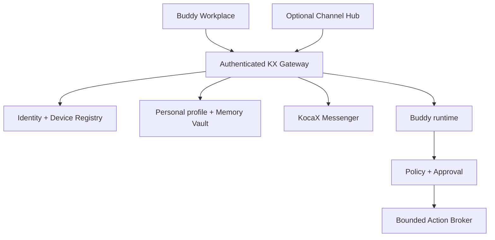

# Technical architecture

## Reference package shape

```text
apps/workplace        responsive customer control-panel preview
apps/api              fail-closed in-memory reference API
packages/contracts    versioned schemas and deterministic policy
contracts             OpenAPI and portable JSON contract
docs                   inventories, ADRs, testing and handoff material
scripts                static checks, manifest generation and verification
```

This is a modular reference, not a final microservice topology.

## Target trust boundaries



Target invariants:

1. The server derives `owner_user_id`, `workspace_id` and `buddy_id` from the authenticated session.
2. No request body, webhook or model output selects another owner/workspace.
3. Personal data is never joined with Business/Operations data.
4. Connector adapters cannot query Memory Vault or call executors directly.
5. Models only propose; deterministic code controls authorization and execution.
6. Renderer receives whitelisted visual events only.
7. OAuth/API secrets are stored outside model, browser, logs and Passport.
8. Idempotency and reconciliation are mandatory for every external effect.

## Canonical entities

| Entity | Core invariant |
|---|---|
| UserAccount | Adult personal owner; one personal workspace in launch scope |
| PersonalWorkspace | No Business tenant fields or switching in this product |
| Buddy | Stable system ID; mutable display name |
| DeviceSession | Server-authenticated; independently revocable |
| BuddyProfile | Style, life pack, control profile and memory policy as separate fields |
| AvatarAppearance | Renderer-independent schema/rig/catalog/equipment/palette |
| WardrobeItem | Immutable ID, slot, compatibility, rights ref, hash, fallback |
| MemoryItem | Source, reason, scope, consent, timestamps, expiry and lifecycle |
| Task/Reminder/Routine | Personal work; external effects become ActionProposal |
| Connection | Existing Buddy mapping; scoped and revocable; disabled by default |
| PermissionGrant | Independent of cosmetics; bounded scope and duration |
| ActionProposal | Exact type, target, payload digest, risk and idempotency |
| Approval | Native Workplace owner, exact binding, server-issued nonce digest, expiry and single-use |
| ActionReceipt | Actual result, not model intention |
| BuddyPassport | Portable allowed data; explicit no-secrets list |
| FeatureEvidence | Status, evidence, owner, version and verified date |

## Risk levels

| Risk | Reference behavior |
|---|---|
| R0 | Read allowlisted internal/native data; no external effect |
| R1 | Internal/reversible task or draft; policy-controlled, receipt required where persisted |
| R2 | Send/publish/invite/calendar/customer-data change; exact Workplace approval |
| R3 | Pay/delete/deploy/security/access; denied in this package; future production flow requires trusted step-up |

## Production adapters still required

- OIDC/passkeys and device registry;
- PostgreSQL authorization/RLS and migrations;
- object storage plus scan/quarantine;
- secrets vault;
- transactional outbox and executor fencing;
- audit store and privacy-safe logs;
- notification service;
- clean-host backup/restore;
- feature flags and kill switches;
- KocaX Messenger transport and verified crypto mode;
- separately approved calendar connector;
- signed avatar manifest verification.
